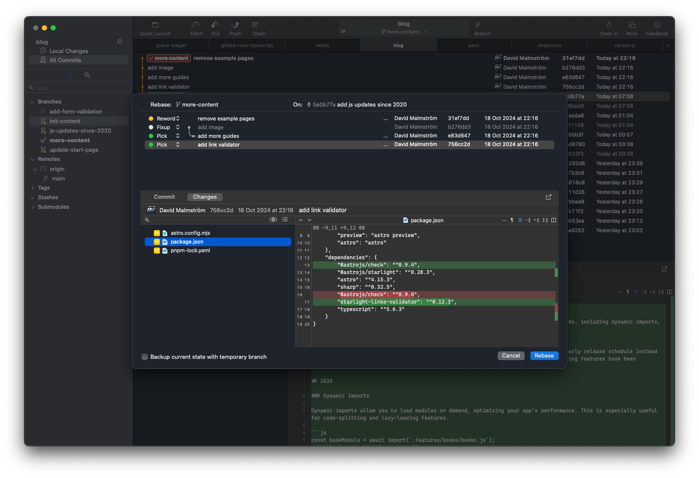

## Fork

Fork is a great git GUI client that I have been using professionally and privately for the last five years. It makes it easy to get an overview of branches, it has good defaults and the keyboard shortcuts makes allows you to move fast. The visual interactive rebasing is a breeze and made me feel safe to experiment with rebasing, it can even backup your branch before doing it.

Built by Dan and Tanya Pristupov from Czechia.

[Download Fork](https://fork.dev/)

## Other git tools

- [Beyond Compare](https://www.scootersoftware.com/home): Advanced compare tool
