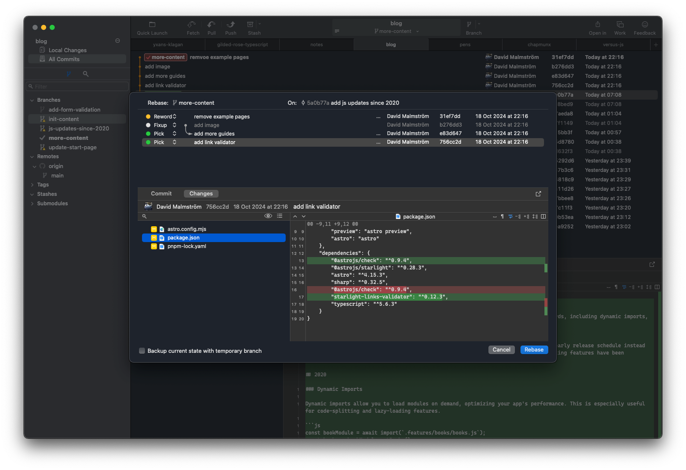

## General software

- [ScreenToGif](https://www.screentogif.com/): Screen recorder with an integrated editor. Output to `.gif`, and `.mp4` by checking to download ffMPEG during install.
- [Flameshot](https://flameshot.org/): Open-source cross-platform screenshot tool with editor where you can add arrows, boxes, blur, etc.
- [shottr](https://shottr.cc/): Beautiful screen shot tool for macOS.
- [Microsoft PowerToys](https://learn.microsoft.com/en-us/windows/powertoys/): Utilities to customize Windows with many features, you enable what you want.
  - [FancyZones](https://learn.microsoft.com/en-us/windows/powertoys/fancyzones): A window manager utility for arranging and snapping windows into efficient layouts to improve your workflow and restore layouts quickly
  - [Hosts File Editor](https://learn.microsoft.com/en-us/windows/powertoys/hosts-file-editor): A convenient way to edit the hosts file.
  - [Keyboard Manager](https://learn.microsoft.com/en-us/windows/powertoys/keyboard-manager): Enables you to redefine keys on your keyboard.
  - [PowerRename](https://learn.microsoft.com/en-us/windows/powertoys/powerrename): A bulk renaming tool that enables you to change many files' names, search and replace, etc.
  - [PowerToys Run](https://learn.microsoft.com/en-us/windows/powertoys/run): A quick launcher for Windows, use <kbd>Alt</kbd>+<kbd>Space</kbd> to show the quick launcher. Useful for quick calculations and unit conversions.
  - [Text Extractor](https://learn.microsoft.com/en-us/windows/powertoys/text-extractor): Enables you to copy text from anywhere on your screen.

## Git

### Fork

Fork is a fast, polished git GUI client. It provides a clear branch overview, good defaults, and keyboard shortcuts that allow quick navigation. The visual interactive rebase makes rebasing approachable — it can even back up your branch before starting.

Built by Dan and Tanya Pristupov from Czechia.

[Download Fork](https://fork.dev/)

### Other git tools

- [Beyond Compare](https://www.scootersoftware.com/home): Advanced compare tool

## Online tools

- [Markdown Table Generator](https://tableconvert.com/markdown-generator)
